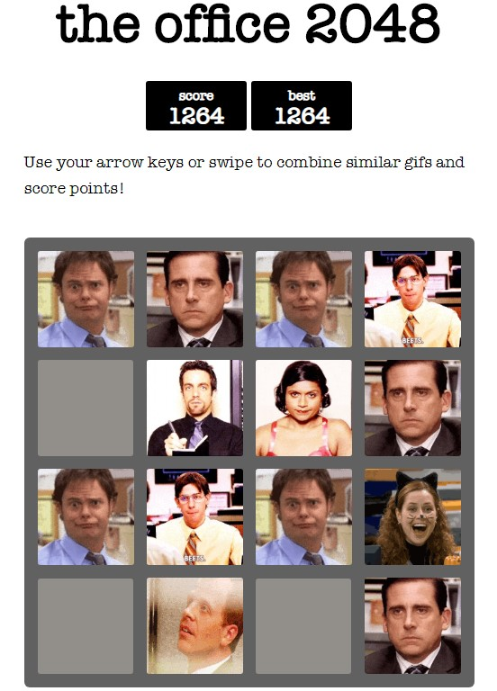

# The Office 2048
A small clone of [2048](https://play2048.co) (which, in turn, was inspired by [1024](https://play.google.com/store/apps/details?id=com.veewo.a1024)), based on the hit American TV show, **The Office**.

Made just for fun. [Play it here!](http://www.theoffice2048.com/)

**Important note:** This game is made just for fun and neither affliated to NBC nor aims to make any kind of money off of The Office IP.

### Contributions

This game is based on the original [2048](https://play2048.co) so shout out to [Gabriele Cirulli](https://github.com/gabrielecirulli) for making it free and open source. And since the orignal one had important contributions from a bunch of contributors, shout out to each of them too!

All the GIFs are sourced from [Giphy](https://giphy.com). [EZGIF](https://ezgif.com) is an amazing website that helped me in editing and optimising the GIFs for a smooth experience.

The cookie information dialogue used is a free-to-use JavaScript plug-in developed by [João Pereira](http://joaopereira.pt) called cookieBubble.

### Version History

24/04/20 - Initial Commit.\
25/04/20 - Optimised GIFs by 20% to load faster on slow network speeds, replaced certain WebP format files with GIFs for Safari and Firefox support and added Apple startup images.\
26/04/20 - Changed cookieBubble design elements.\
11/04/21 - Linked a custom domain to the project.

### Platforms Tested

The Office 2048 was tested on:

 - iPad running iOS 9.3.6 with Safari 9
 - iPhone running iOS 12.4.6 with Safari 12
 - Android 9 running Chrome 80.0.3987.132
 - Android 10 running Chrome 80.0.3987.132
 - Google Chrome (x64) 81.0.4044.122
 - Firefox (x64) 75.0

### Screenshot

  

## Contributing
Changes and improvements are welcome. Feel free to fork and open a pull request. Please make your changes in a specific branch and always request to pull into `master`! However, please make sure the game fully works before sending the PR, as that will help speed up the process and prevent the game from breaking.

## License
The Office 2048 is licensed under the [MIT license](https://github.com/ravjitsingh/theoffice2048/blob/master/LICENSE.txt)

## Donations
I worked on this game in my free time, and since it's hosted on GitHub, I don't have any hosting costs. But if you enjoyed the game, you'd probably want to check out my other [projects](#) or just [buy me a coffee](https://www.buymeacoffee.com/ravjit)! Thank you very much!
